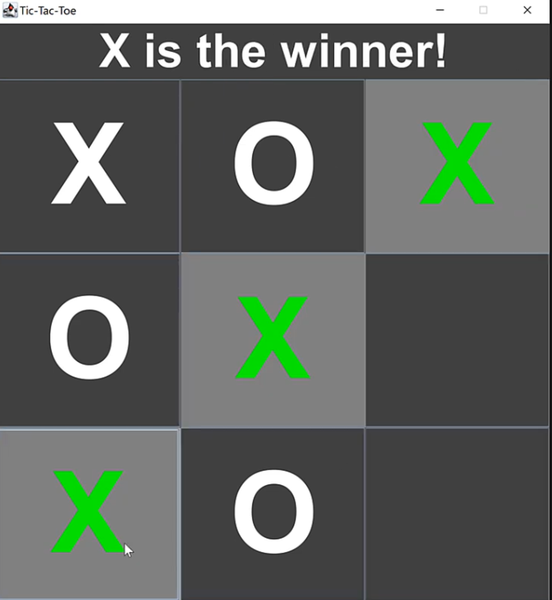

# 🎮 Tic-Tac-Toe in Java

This is a simple Tic-Tac-Toe game made with Java. Players can play against each other or the computer.

## 🛠 Features
✅ Play against another player  
✅ Play against the computer  
✅ Simple and easy-to-use design  
✅ Prevents invalid moves  

## 🚀 Technologies Used
- Java (Game logic)  
- Java Swing (If using a graphical interface)  

## 📸 Game Preview


## 🔧 How to Run
1. Clone this repository:  
   ```sh
   git clone https://github.com/your-username/tic-tac-toe-java.git
